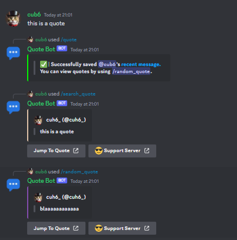
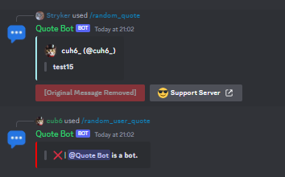

# Quote Bot

### **Overview**
A bot that allows users to save a message sent by a user as a quote, which can then be sent again whenever through slash commands.

This can theoretically work as a "message sniping" bot.

---

### **Features**
- Organized code
- Easy to setup
- Slash commands utilization
---

### **lnstallation**
1) `git clone` this repo.
```
git clone https://github.com/Cuh4/QuoteBot
cd QuoteBot
```

2) Run the following commands:
```
py -m pip install -r requirements.txt
```

3) Create a Discord bot at https://discord.com/developers/applications. **Be sure to enable message content intents for your bot, otherwise it will not properly function.**

4) In the `src` folder, edit `example_config.py` then rename to `config.py` when completed. Be sure to plop your bot's token in the config file.

5) Start the bot using the following commands:
```
cd src
py main.py
```

6) Invite your bot to a server.

7) Use the slash commands provided by the bot.

---

### **Images**


